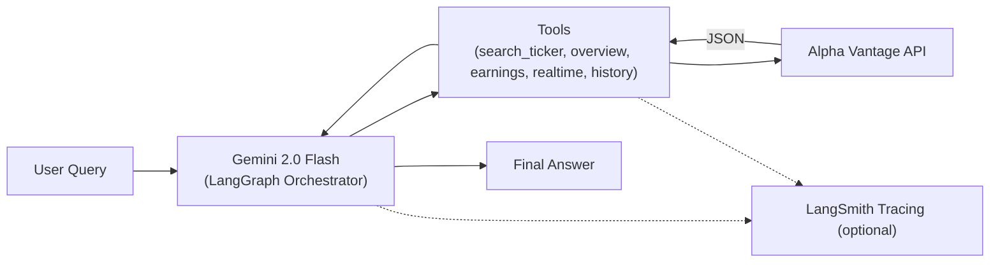
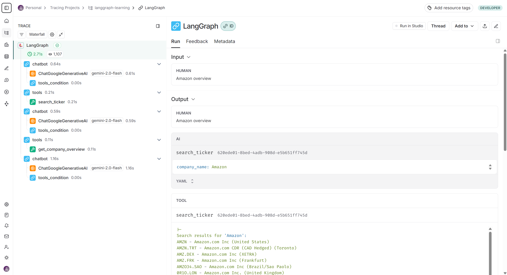

# 📈 Stock Analysis Agent with LangGraph

This repository documents building a production-ready **Stock Analysis Agent** that fetches real-time financial data, performs analysis, and integrates with Claude Desktop via the **Model Context Protocol (MCP)**.  
The work starts with exploratory notebooks and culminates in a deployable **MCP server** under `stock-agent-mcp/`.

---

## 📂 Project Structure

```
stock-analysis-agent-langgraph/
├─ .env.example                # Example env vars for root
├─ README.md                   # This README
│
├─ docs/                       # Screenshots & traces from LangSmith runs
│
├─ 1_simple_graph.ipynb        # Basics of LangGraph state graphs
├─ 2_graph_with_condition.ipynb # Adding conditional flows
├─ 3_chatbot.ipynb             # Simple chatbot agent
├─ 4_tool_call.ipynb           # Demonstrates calling external tools
├─ 5_tool_call_agent.ipynb     # Agent with tool orchestration
├─ 6_memory.ipynb              # LangGraph agent with memory
├─ 7_langsmith.ipynb           # Integration with LangSmith tracing
├─ 8_HITL.py                   # Human-in-the-loop example in Python
├─ 9_agent_real_time_stock_price.ipynb # Final stock analysis agent with tools
│
└─ stock-agent-mcp/            # Production-ready MCP server
   ├─ .env.example             # Example env for server
   ├─ README.md                # Server-specific README
   ├─ server.py                # MCP server entrypoint
   ├─ docs/                    # Demo media for MCP server
   └─ src/
      └─ langgraph_agent/
         └─ tools.py           # Tool definitions (stock price, earnings, etc.)
```

---

## ✨ Key Features

- **LangGraph** tool orchestration  
- **Alpha Vantage API** for financial data (prices, earnings, company overview, historical)  
- **Gemini LLM** for reasoning/orchestration (`langchain-google-genai`)  
- **LangSmith** tracing (add env vars and it works automatically)  
- **HITL** example for sensitive operations  
- **MCP server** integration for Claude Desktop

---

## 🧭 Architecture (Notebook 9 – Final Agent)


---

## 🛠️ Tech Stack

- [LangGraph](https://github.com/langchain-ai/langgraph) • [LangChain](https://github.com/langchain-ai/langchain)  
- [Gemini API](https://ai.google.dev/gemini-api) (via `langchain-google-genai`)  
- [Alpha Vantage](https://www.alphavantage.co/) (financial data)  
- [LangSmith](https://smith.langchain.com/) (optional tracing)  
- [Model Context Protocol (MCP)](https://modelcontextprotocol.io/)  
- Env & packaging with [`uv`](https://github.com/astral-sh/uv)

---

## 📸 Snapshot of Trace


> **Trace Explanation:** This snapshot shows how the agent processes a query step by step — from the LLM’s reasoning, to tool calls, and finally producing the answer.

---

## ⚡ Setup

> Prereqs: Python 3.12+, `uv` installed

1) **Clone & enter the repo**
```bash
git clone https://github.com/neelagarwal98/stock-analysis-agent-langgraph.git
cd stock-analysis-agent-langgraph
```

2) **Install dependencies (root workspace)**
```bash
uv sync
```

3) **Configure environment variables**  
Root and server each provide a separate example file:
- **Root:** copy `.env.example` → `.env` (used by notebooks)  
- **Server:** copy `stock-agent-mcp/.env.example` → `stock-agent-mcp/.env`

Populate the keys you have:
```env
# Common (used across notebooks / server)
ALPHAVANTAGE_API_KEY=...
ALPHA_VANTAGE_BASE_URL=https://www.alphavantage.co/query

GEMINI_API_KEY=...

# Optional (enables tracing automatically if set)
LANGSMITH_TRACING=true
LANGSMITH_ENDPOINT=https://api.smith.langchain.com
LANGSMITH_API_KEY=...
LANGSMITH_PROJECT=<project-name>
```

4) **Run notebooks (root)**
```bash
uv run jupyter lab
```

---

## 📬 Where to Look Next

- **Server details, how to run, and demo media:**  
  [`stock-agent-mcp/README.md`](stock-agent-mcp/README.md)

---

## 📝 License

This project is licensed under the terms described in **[LICENSE](LICENSE)**.
