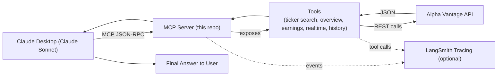

# 🖥️ Stock Agent MCP Server

This is a **production-ready MCP server** which makes real-time stock market data available to **Claude Desktop** (or any MCP-compatible client).
It doesn’t run its own LLM — instead, it provides Claude with a set of financial tools that can be called when needed. Using these tools, Claude can look up tickers, fetch live prices, review company overviews, or check recent earnings directly from the **Alpha Vantage API**.  

This folder contains the deployable MCP component of the broader [Stock Analysis Agent project](../README.md).

---

## 📂 Folder Structure

```
stock-agent-mcp/
├─ .env.example             # Example environment
├─ README.md                # This file
├─ server.py                # MCP server entrypoint
├─ docs/                    # Demo media
└─ src/
   └─ langgraph_agent/
      ├─ __init__.py
      └─ tools.py           # Alpha Vantage-backed tool implementations
```

---

## 🧭 Architecture



- **Claude Desktop** is the LLM (Claude Sonnet).  
- The **MCP server** acts as a tool provider only.  
- Tools call the **Alpha Vantage API** to fetch real data.  
- Claude combines results into the **final answer** for the user.  
- **LangSmith tracing** (optional) can be enabled via env vars to log tool usage.

---

## 🛠️ Tools

- `search_ticker` — company name → ticker candidates  
- `get_company_overview` — sector, market cap, EPS, P/E, revenue, etc.  
- `get_realtime_stock` — latest intraday price  
- `get_historical_stock_data` — daily/weekly/monthly history  
- `get_earnings_data` — most recent quarterly earnings

---

## ⚙️ Setup

> Prereqs: Python 3.12+, [`uv`](https://github.com/astral-sh/uv) installed, Claude Desktop installed.

1. **Install dependencies**
```bash
cd stock-agent-mcp
uv sync
```

2. **Configure environment**
```bash
cp .env.example .env
# then edit .env and set:
# ALPHA_VANTAGE_API_KEY=your_key
```

3. **Install the server into Claude Desktop**
```bash
uvx mcp install server.py
# or equivalently:
uv run --with mcp[cli] mcp install server.py
```

This updates Claude Desktop’s config so the MCP server is registered automatically. Restart Claude Desktop and check **Settings → Developer** to confirm.

4. **Manual configuration (optional)**  
If you prefer, add an entry like this to `claude_desktop_config.json`:

```json
{
  "mcpServers": {
    "stock-agent-mcp": {
      "command": "uv",
      "args": ["run", "--with", "mcp[cli]", "mcp", "run", "server.py"],
      "cwd": "/ABSOLUTE/PATH/TO/stock-agent-mcp"
    }
  }
}
```

---
## 📝 Notes

- Tools are implemented in `src/langgraph_agent/tools.py`.  
- **No LLM runs inside this server** — Claude Desktop (Claude Sonnet) does the reasoning.  
- Optional **LangSmith tracing** can be enabled by adding the appropriate env vars.  
- For the full learning journey and notebooks, see the [root README](../README.md).

---

## 📝 License

This project is licensed under the terms described in **[LICENSE](../LICENSE)**.
